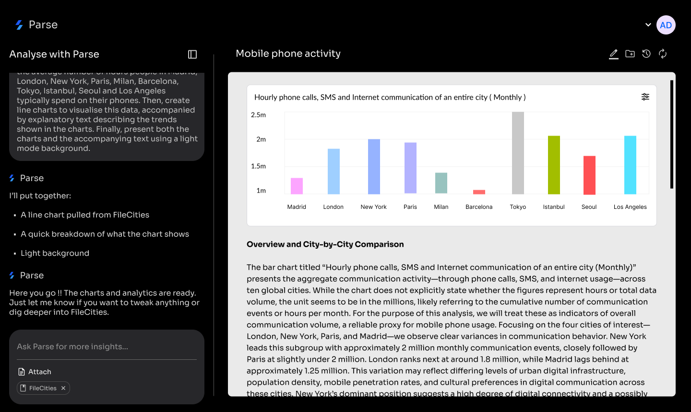

# Parse - Research Document Analysis Platform

A powerful AI-powered research tool that allows users to upload documents, extract and analyze data, generate customizable charts, compare datasets, and collaborate with team members.



## Features

- **Document Upload & Processing**: Upload PDF, CSV, Excel, images, and text files
- **AI-Powered Analysis**: Conversational interface for asking questions about your documents
- **Chart Generation**: Auto-generate and customize charts (Bar, Line, Pie, Area, Scatter)
- **Document Comparison**: Compare documents and charts side by side
- **Team Collaboration**: Invite users, manage roles, and collaborate in real-time
- **Branding & Customization**: Custom color palettes, fonts, and themes for exports

## Tech Stack

### Frontend
- Next.js 14 (App Router)
- TypeScript
- Tailwind CSS
- Recharts
- Zustand (State Management)
- Socket.io Client

### Backend
- Node.js with Express
- SQLite with Prisma ORM
- JWT Authentication
- Socket.io (Real-time)
- Mock AI Service

## Getting Started

### Prerequisites
- Node.js 18+
- npm or yarn

### Installation

1. **Clone the repository**
   ```bash
   cd /Users/ali/Documents/Parse
   ```

2. **Install Backend Dependencies**
   ```bash
   cd backend
   npm install
   ```

3. **Set up the Database**
   ```bash
   npm run db:push
   npm run db:generate
   ```

4. **Start the Backend Server**
   ```bash
   npm run dev
   ```
   The API will be available at http://localhost:3001

5. **Install Frontend Dependencies** (in a new terminal)
   ```bash
   cd frontend
   npm install
   ```

6. **Start the Frontend**
   ```bash
   npm run dev
   ```
   The app will be available at http://localhost:3000

## Environment Variables

### Backend (.env)
```env
DATABASE_URL="file:./dev.db"
JWT_SECRET="your-secret-key"
PORT=3001
FRONTEND_URL="http://localhost:3000"
```

### Frontend (.env.local)
```env
NEXT_PUBLIC_API_URL=http://localhost:3001/api
NEXT_PUBLIC_SOCKET_URL=http://localhost:3001
```

## Project Structure

```
Parse/
├── backend/
│   ├── src/
│   │   ├── controllers/
│   │   ├── middleware/
│   │   ├── routes/
│   │   ├── services/
│   │   └── index.ts
│   ├── prisma/
│   │   └── schema.prisma
│   └── uploads/
│
├── frontend/
│   ├── app/
│   │   ├── (auth)/
│   │   │   ├── login/
│   │   │   └── register/
│   │   └── (dashboard)/
│   │       ├── chat/[id]/
│   │       ├── documents/
│   │       ├── compare/
│   │       └── settings/
│   ├── components/
│   │   ├── ui/
│   │   ├── chat/
│   │   ├── charts/
│   │   ├── documents/
│   │   └── layout/
│   └── lib/
│
└── README.md
```

## API Endpoints

### Authentication
- `POST /api/auth/register` - Register new user
- `POST /api/auth/login` - Login
- `GET /api/auth/me` - Get current user

### Documents
- `GET /api/documents` - List documents
- `POST /api/documents/upload` - Upload document
- `GET /api/documents/:id` - Get document
- `DELETE /api/documents/:id` - Delete document

### Analyses
- `GET /api/analyses` - List analyses
- `POST /api/analyses` - Create analysis
- `GET /api/analyses/:id` - Get analysis with messages
- `POST /api/analyses/:id/messages` - Send message

### Charts
- `GET /api/charts` - List charts
- `POST /api/charts` - Create chart
- `PATCH /api/charts/:id` - Update chart
- `POST /api/charts/:id/duplicate` - Duplicate chart

### Workspaces
- `GET /api/workspaces` - List workspaces
- `POST /api/workspaces` - Create workspace
- `POST /api/workspaces/:id/invite` - Invite user
- `GET /api/workspaces/:id/members` - List members

### Settings
- `GET /api/settings/branding` - Get branding
- `PATCH /api/settings/branding` - Update branding

## Usage

### 1. Create an Account
Register at `/register` with your email and password.

### 2. Upload Documents
Navigate to Documents and upload your research files (PDF, CSV, Excel, etc.).

### 3. Start an Analysis
Create a new analysis and attach documents. Ask questions in natural language:
- "Create a bar chart comparing the cities"
- "Summarize the key findings"
- "Compare the data between Tokyo and New York"

### 4. Customize Charts
Use the chart customizer to change:
- Chart type (Bar, Line, Pie, Area)
- Color palette
- Background (Dark/Light)
- Show/hide legend and grid

### 5. Collaborate
Invite team members from Settings > Team and assign roles:
- **Viewer**: Can view documents and analyses
- **Editor**: Can create and edit content
- **Admin**: Full access to workspace settings

## License

MIT
